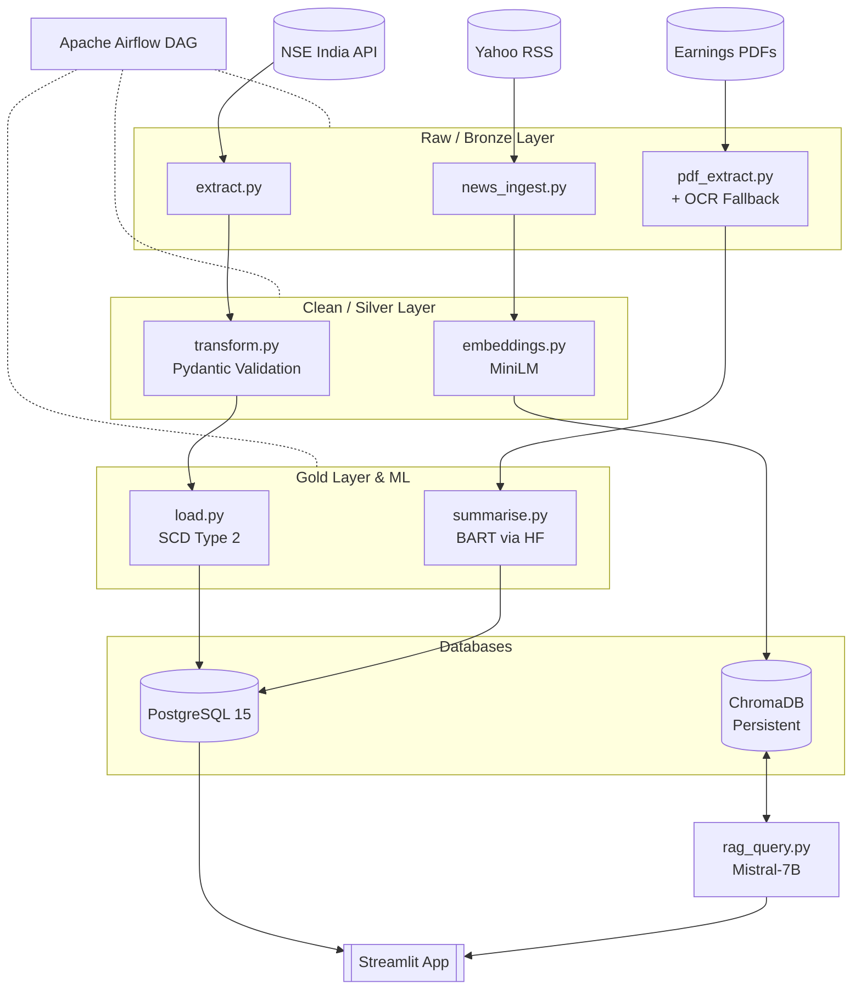

# Production NSE Stock Market Pipeline

A production-ready data pipeline and ML layer capturing NSE stock data, analyzing PDF earnings statements, and embedding daily news for a locally-served RAG application.

## 🏗 Stack Architecture



## 🔒 The 8 Hardened Production Rules Evaluated

1. **HF API Budget:** Hard-capped at 80 calls/day across embeddings/summaries, managed transactionally in Postgres (`hf_api_budget`).
2. **ChromaDB Persistence:** Runs explicitly as a distinct `chromadb_data` Docker volume. Ephemeral clients strictly rejected.
3. **OCR Fallback Guard:** `pdf_extract.py` checks parsing text density (`>= 200` chars); falls back to `pytesseract` automatically, raising safe errors upon total unreadability.
4. **RAG Hallucination Guard:** Embeddings enforce a threshold mapping (`cosine similarity >= 0.4`). Empty/unrelated context hard-returns *"Insufficient Data"* over wild guessing, and always links back to specific hashed RSS URLs.
5. **Idempotent DAG Dependencies:** Explicit chains ensure `db_init` spins up cleanly before ANY table dependencies, and ML summary jobs cannot run until Gold dimension loads complete successfully.
6. **News Deduplication:** Feed ingestion strictly hashes source URLs via SHA256 mapping. Postgres unique constraints handle `ON CONFLICT DO NOTHING`.
7. **Model Metadata Guard:** Pipeline checks `pipeline_metadata` dimensions and model names at startup to block rogue local model dimension swaps into ChromaDB.
8. **SQL Injection Guard:** Streamlit UI utilizes a distinct scoped `readonly_user`. Internal ML mapping queries use Regex filtering to drop `DELETE`/`DROP` statements and safely inject `LIMIT 1000`.

## 🚀 Quickstart Development

```bash
# 1. Spin up dependencies
docker-compose up -d

# 2. Setup Virtual Environment
python -m venv venv
venv\Scripts\activate
pip install -r requirements.txt

# 3. Create a .env file (see settings.py for variables)
# POSTGRES_USER, POSTGRES_PASSWORD, HF_API_TOKEN, etc.

# 4. Initialize Database
python -m backend.pipeline.db_init

# 5. Run the Streamlit UI
streamlit run frontend/app.py
```
